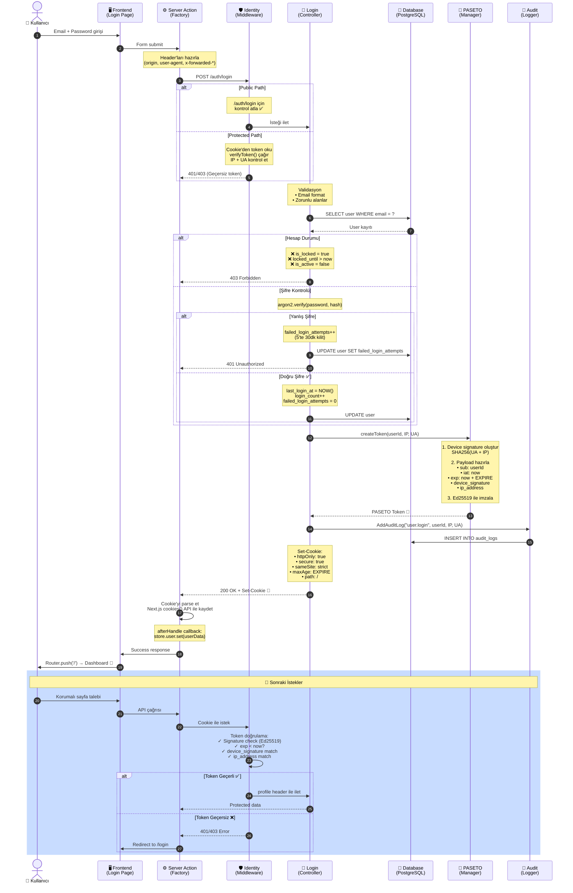

# Nucleus - Veritabanı Şemaları Dokümantasyonu

Bu dokümantasyon, Nucleus projesinin temel veritabanı yapısını ve standart tablo şemalarını açıklamaktadır.

---

## 📋 İçindekiler

1. [Genel Bakış](#-genel-bakış)
2. [Standart Tablo Yapısı](#-standart-tablo-yapısı)
3. [Tablo Dosyası Anatomisi](#-tablo-dosyası-anatomisi)
4. [Core Tablolar](#-core-tablolar)
5. [Kimlik ve Yetkilendirme Tabloları](#-kimlik-ve-yetkilendirme-tabloları)
6. [Multi-Tenant Yapısı](#-multi-tenant-yapısı)
7. [Onaylama Mekanizması](#-onaylama-mekanizması)
8. [İlişki Modelleri](#-i̇lişki-modelleri)
9. [Kimlik Doğrulama Akışı](#-kimlik-doğrulama-akışı)

---

## 🎯 Genel Bakış

Nucleus projesi, kimlik doğrulama, yetkilendirme, dosya yönetimi, loglama ve onay süreçleri gibi temel özellikleri destekleyen standartlaştırılmış bir veritabanı yapısı sunar.

### Standart Tablolar

| Tablo | Açıklama | Kategori |
|-------|----------|----------|
| `user` | Kullanıcı kimlik bilgileri | Kimlik Doğrulama |
| `profile` | Kullanıcı profil bilgileri | Kimlik Doğrulama |
| `address` | Adres kayıtları (1:N) | İlişkili Veriler |
| `phone` | Telefon kayıtları (1:N) | İlişkili Veriler |
| `file` | Dosya ve medya yönetimi | Dosya Sistemi |
| `claim` | Yetki tanımları | Yetkilendirme |
| `user_claim` | Kullanıcı-yetki ilişkisi (M:N) | Yetkilendirme |
| `tenants` | Kiracı bilgileri | Multi-Tenant |
| `company` | Şirket/kurum bilgileri | Multi-Tenant |
| `verification_requirement` | Onay gereksinim tanımları | Onaylama |
| `verification` | Onaylama kayıtları | Onaylama |
| `audit` | İşlem logları | Loglama |

---

## 🏗️ Standart Tablo Yapısı

Her tablo dosyası aşağıdaki standartlaştırılmış yapıya sahiptir:

### Zorunlu Alanlar

```typescript
{
  tablename: string;              // Çoğul, camelCase tablo adı
  excluded_methods: GenericMethods[];  // Otomatik oluşturulmasını istemediğiniz HTTP metotları
  is_formdata: boolean;           // FormData ile dosya yüklemesi yapılacak mı?
  columns: ColumnDefinitions;     // Drizzle ORM kolon tanımları
  indexes: IndexDefinitions;      // Veritabanı indeksleri
}
```

### Otomatik Oluşturulan Tipler

Her tablo için aşağıdaki TypeScript tipleri otomatik olarak üretilir:

| Tip | Açıklama |
|-----|----------|
| `<TableName>` | Ham veritabanı satır tipi |
| `<TableName>JSON` | Frontend için JSON serialize edilmiş tip |
| `Create<TableName>` | POST endpoint için input tipi |
| `Read<TableName>` | GET endpoint için output tipi |
| `Update<TableName>` | PATCH/PUT endpoint için input tipi |
| `Delete<TableName>` | DELETE endpoint için input tipi |
| `ListReturn<TableName>` | Liste endpoint için paginated output tipi |

### Özel Alanlar

#### `T_` Prefix
Drizzle ORM'in tip çıkarımı için kullanılan tablo alias'ları:

```typescript
const T_Users = pgTable("users", { ... });
```

#### `createTableForSchema`
Multi-tenant mimaride aynı şema içindeki ilişkili tabloları işaretlemek için kullanılır. Drizzle'ın recursive tablo ilişkilerini doğru şekilde çözümlemesini sağlar.

#### `store`
Frontend'de global API store oluşturmak için gerekli metadata:

```typescript
store: {
  entity: "users",
  methods: ["list", "create", "read", "update", "delete"]
}
```

#### `SearchConfig`
Generic search endpoint için yapılandırma. Detaylı bilgi için `GenericSearch` paketinin README'sini inceleyebilirsiniz.

---

## 🧩 Tablo Dosyası Anatomisi

### Base.ts - Temel Alanlar

**Dosya:** `base.ts`

Audit tablosu dışındaki tüm tablolarda kullanılan temel alanlar:

```typescript
{
  id: uuid("id").primaryKey().defaultRandom(),
  is_active: boolean("is_active").notNull().default(true),  // Soft delete
  created_at: timestamp("created_at").defaultNow().notNull(),
  updated_at: timestamp("updated_at").defaultNow().$onUpdate(() => new Date()),
}
```

> **Not:** 
> - Audit tablosu, yapısal ve mimari ihtiyaçlar gereği bu temel alanları içermez.
> - `is_active` alanı soft delete için kullanılır, `is_deleted` yerine tercih edilmiştir.
> - `updated_at` alanı otomatik olarak her güncelleme sırasında şimdiki zamanla güncellenir.

---

## 🔐 Core Tablolar

### 1. User & Profile - Kullanıcı Yönetimi

#### User Tablosu
**Dosya:** `user.ts`

Kimlik doğrulama ve güvenlik bilgilerini içerir:

- `email` - Benzersiz email adresi (varchar 255)
- `password` - Argon2 ile hashlenmiş şifre (varchar 255)
- `verified_at` - Email doğrulama zamanı
- `last_login_at` - Son giriş zamanı
- `login_count` - Toplam giriş sayısı (default: 0)
- `is_locked` - Hesap kilidi durumu (default: false)
- `locked_until` - Kilit bitiş zamanı
- `failed_login_attempts` - Başarısız giriş sayacı (default: 0)
- `is_god` - Süper admin yetkisi (default: false)

> **Mimari Karar:** Güvenlik kritik verileri ayırarak, profile tablosunda daha esnek genişletme imkanı sağlanmıştır.

#### Profile Tablosu
**Dosya:** `profile.ts`

Kullanıcı profil bilgilerini içerir:

- `user_id` - User tablosu referansı (1:1, unique)
- `first_name` - Ad (varchar 100, not null)
- `last_name` - Soyad (varchar 100, not null)

> **Genişletilebilirlik:** Proje gereksinimlerine göre yeni alanlar eklenebilir (örn: avatar_file_id, date_of_birth, vs.).

---

### 2. Address - Adres Yönetimi

**Dosya:** `address.ts`

**İlişki:** Polymorphic (owner_type + owner_id)

```typescript
{
  owner_type: varchar(50),     // "user", "company", vs.
  owner_id: uuid,              // Sahibin ID'si
  name: varchar(100),          // "Ev", "İş", vs.
  street: varchar(255),
  city: varchar(100),
  state: varchar(50),
  zip: varchar(20),
  country: varchar(50),        // default: "US"
  latitude: decimal(10,8),
  longitude: decimal(11,8),
  neighborhood: varchar(100),
  apartment: varchar(50),
  province: varchar(100),
  district: varchar(100),
  type: varchar(50),
}
```

> **Mimari Karar:** Polymorphic ilişki kullanılarak, hem user hem company hem de diğer entityler için adres desteği sağlanmıştır.

---

### 3. Phone - Telefon Yönetimi

**Dosya:** `phone.ts`

**İlişki:** Polymorphic (owner_type + owner_id)

```typescript
{
  owner_type: varchar(50),     // "user", "company", vs.
  owner_id: uuid,              // Sahibin ID'si
  name: varchar(100),          // "Cep", "İş", vs.
  type: varchar(50),           // "mobile", "office", "fax"
  number: varchar(20),
  country_code: varchar(10),   // default: "+1"
  extension: varchar(10),
}
```

> **Mimari Karar:** Address ile aynı polymorphic yaklaşım, telefon numaralarının da kolayca yönetilmesini sağlar.

---

### 4. File - Dosya ve Medya Yönetimi

**Dosya:** `file.ts`

Tüm medya dosyalarının merkezi yönetimi:

```typescript
{
  name: varchar(255),           // Dosya adı
  original_name: varchar(255),  // Orijinal dosya adı
  type: varchar(50),            // "image", "document", "video", "audio", "profile_picture"
  path: varchar(500),           // Depolama yolu
  size: bigint,                 // Dosya boyutu (bytes)
  mime_type: varchar(100),      // MIME type
  extension: varchar(10),       // Dosya uzantısı
  uploaded_by: uuid,            // Yükleyen kullanıcı (user_id referans)
}
```

#### Özellikler

- ✅ **CDN Desteği:** Backend, dosya sunumu için CDN gibi çalışabilir
- ✅ **Streaming:** Büyük dosyalar için chunk-based streaming
- ✅ **Cache:** Otomatik HTTP cache header'ları
- ✅ **Generic Route:** `/file/:id` endpoint'i ile tüm dosyalara erişim

> **Detaylı Bilgi:** FileManager README'sini inceleyebilirsiniz.

---

### 5. Audit - İşlem Logları

**Dosya:** `audit.ts`

Tüm kritik işlemlerin kayıt altına alınması:

```typescript
{
  id: uuid,                       // Primary key
  user_id: uuid,                  // İşlemi yapan kullanıcı
  entity_name: varchar(100),      // Tablo adı
  entity_id: uuid,                // Kayıt ID'si
  operation_type: varchar(20),    // "INSERT", "UPDATE", "DELETE", "SOFT_DELETE"
  summary: varchar(500),          // İşlem özeti
  old_values: jsonb,              // Eski değerler
  new_values: jsonb,              // Yeni değerler
  ip_address: varchar(45),        // IPv6 destekli
  user_agent: varchar(500),       // Tarayıcı bilgisi
  timestamp: timestamp,           // İşlem zamanı
}
```

> **Not:** Audit tablosu, base.ts alanlarını içermez. Logların silinmemesi ve değiştirilmemesi için CREATE, UPDATE, DELETE ve TOGGLE metodları excluded_methods ile kapatılmıştır.

---

## 🔑 Kimlik ve Yetkilendirme Tabloları

### 6. Claim - Yetki Tanımları

**Dosya:** `claim.ts`

Resource-based yetkilendirme sistemi:

```typescript
{
  action: varchar(100),         // Yetki adı, unique
  description: varchar(500),    // Açıklama
  path: varchar(200),           // Endpoint path, örn: "/api/users"
  method: varchar(10),          // HTTP metot: "GET", "POST", vs.
  mode: varchar(20),            // "exact" | "startsWith"
}
```

> **Mimari Karar:** Geleneksel rol tabanlı yetkilendirme yerine, **kaynak erişim tabanlı** esnek bir yapı tercih edilmiştir.

#### Örnek Claims

| Action | Path | Method | Mode | Açıklama |
|--------|------|--------|------|----------|
| `users.list` | `/api/users` | `GET` | `exact` | Kullanıcı listesini görüntüleme |
| `users.create` | `/api/users` | `POST` | `exact` | Yeni kullanıcı oluşturma |
| `reports.view` | `/api/reports` | `GET` | `startsWith` | Rapor görüntüleme |

> **⚠️ Geliştirme Notu:** Daha granüler kontroller için henüz bir çözüm oluşturulmamıştır. Bu nedenle Identity middleware'deki yetkilendirme kontrolleri şu an devre dışıdır.

---

### 7. User Claim - Kullanıcı-Yetki İlişkisi

**Dosya:** `user_claim.ts`

**İlişki:** `M:N` (Junction Table)

```typescript
{
  user_id: uuid,         // Kullanıcı referansı
  claim_id: uuid,        // Yetki referansı
  granted_by: uuid,      // Yetkiyi veren kullanıcı
  expires_at: timestamp, // Yetki bitiş tarihi (opsiyonel)
}
```

**Unique Constraint:** `user_id` + `claim_id` kombinasyonu unique

> **Mimari Karar:** Many-to-many ilişkiler için her zaman junction table oluşturulmalıdır. Diğer ilişki tipleri için doğrudan foreign key kullanılır.

---

## 🏢 Multi-Tenant Yapısı

### 8. Tenants - Kiracı Yönetimi

**Dosya:** `tenants.ts`

Multi-tenant mimari etkinleştirildiğinde kullanılır:

```typescript
{
  subdomain: varchar(100),    // "acme" in acme.app.com (unique)
  company_id: uuid,           // Company referansı
  schema_name: varchar(100),  // PostgreSQL schema adı (unique)
}
```

> **Mimari:** Her kiracı için ayrı PostgreSQL schema oluşturulur, bu sayede veri izolasyonu tam olarak sağlanır.

---

### 9. Company - Şirket Bilgileri

**Dosya:** `company.ts`

Tüzel kişilik metadata'sı:

```typescript
{
  owner_id: uuid,        // Şirket sahibi kullanıcı
  name: varchar(255),    // Şirket adı
  tax_id: varchar(50),   // Vergi numarası
  w9: uuid,              // W9 form dosyası (file_id referans)
}
```

**İlişkiler:**
- `owner_id` → `users.id`
- `w9` → `files.id`

---

## ✅ Onaylama Mekanizması

### 10. Verification Requirement - Onay Gereksinimi

**Dosya:** `verification_requirement.ts`

Dinamik onay süreçleri için konfigürasyon:

```typescript
{
  entity_id: uuid,                          // Onay gerektiren kayıt ID'si
  user_title: varchar(50),                  // Onaylayacak kullanıcının ünvanı (Title type)
  premise_user_title: varchar(50),          // Ön koşul kullanıcı ünvanı (opsiyonel)
  is_signature_mandatory: boolean,          // İmza zorunlu mu?
}
```

#### Kullanım Örneği

```typescript
// Belirli bir entity için manager onayı gerekiyor
{
  entity_id: "expense_123",
  user_title: "manager",
  premise_user_title: null,
  is_signature_mandatory: true
}
```

---

### 11. Verification - Onaylama Kayıtları

**Dosya:** `verification.ts`

Onaylama işlem kayıtları:

```typescript
{
  verifier_id: uuid,                               // Onaylayan kullanıcı
  signature_id: uuid,                              // İmza dosyası (file_id referans)
  entity_id: uuid,                                 // Onaylanan kayıt ID'si
  decision: varchar(50),                           // "approved" | "rejected" | "pending"
  reason: varchar(255),                            // Onay/red nedeni
}
```

**İlişkiler:**
- `verifier_id` → `users.id`
- `signature_id` → `files.id`
- `entity_id` → Polymorphic (herhangi bir tablo)

> **Esneklik:** `entity_id` alanı sayesinde herhangi bir tablo için dinamik onay süreçleri oluşturulabilir.

---

## 🔗 İlişki Modelleri

### Mimari Prensip

| İlişki Tipi | Uygulama | Örnek |
|-------------|----------|-------|
| **1:1** | Direct foreign key | `profile.user_id` → `user.id` |
| **1:N** | Foreign key referansı | `address.user_id` → `user.id` |
| **M:N** | Junction table oluştur | `user_claim` (user ↔ claim) |

> **İstisna:** Atama sonucu yeni metadata ihtiyacı doğarsa, junction table'a ek alanlar eklenebilir.

### İlişki Diyagramı

```
┌─────────┐         ┌─────────┐
│  User   │────1:1──│ Profile │
└────┬────┘         └─────────┘
     │
     │ Polymorphic (owner_type + owner_id)
     ├───────┬────────┐
     │       │        │
┌────▼────┐ ┌▼──────┐ ┌▼──────┐
│ Address │ │ Phone │ │ File  │
└─────────┘ └───────┘ └───────┘

┌──────┐      ┌────────────┐      ┌───────┐
│ User │──M:N─│ User_Claim │─M:N──│ Claim │
└──────┘      └────────────┘      └───────┘

┌─────────┐       ┌──────────┐
│ Tenants │───1:1─│ Company  │
└─────────┘       └────┬─────┘
                       │
                Polymorphic owner
                       │
                 ┌─────┴─────┐
                 │           │
            ┌────▼────┐ ┌───▼───┐
            │ Address │ │ Phone │
            └─────────┘ └───────┘

┌────────────────────────┐     ┌──────────────┐
│ Verification_Requirement│─────│ Verification │
└────────────────────────┘     └──────────────┘
           │ entity_id             │ entity_id
           └───────────────────────┘
                  (Polymorphic)
```

---

## 🔐 Kimlik Doğrulama Akışı

Nucleus projesinde kimlik doğrulama tamamen **stateless** bir mimari üzerine kurulmuştur.

### Kullanılan Teknolojiler

| Teknoloji | Amaç | Açıklama |
|-----------|------|----------|
| **PASETO v4.public** | Token üretimi | Ed25519 asymmetric imzalama |
| **Argon2** | Şifre hashleme | Modern, GPU-resistant hashing |
| **HTTP-only Cookie** | Token saklama | XSS korumalı tarayıcı storage |

---

### Akış Şeması

#### 🎨 Görsel Akış (Mermaid)



#### 📋 Detaylı Adımlar

<details>
<summary><b>🔵 1. Frontend: Login Formu</b></summary>

**Dosya:** `apps/fe/app/(pages)/(shared)/login/page.tsx`

- Kullanıcıdan email ve password alınır
- Form submit edilir

</details>

<details>
<summary><b>🔵 2. Next.js Server Action Factory</b></summary>

**Dosya:** `utilities/Nextjs/Actions/Factory/factory.ts`

- Endpoint ayarlarını okur (`Endpoints.LOGIN`)
- Request header'larını hazırlar:
  - `origin`
  - `user-agent`
  - `x-forwarded-for`
  - `x-forwarded-proto`
- Mevcut `auth_token` cookie'sini header'a ekler (login hariç)
- `CustomFetch` ile backend'e POST gönderir

</details>

<details>
<summary><b>🔵 3. Backend: Identity Middleware</b></summary>

**Dosya:** `apps/be/src/middlewares/Identity/index.ts`

- Multi-tenant subdomain'i parse eder
- `company_info` header'ını set eder
- **Public path** ise (`/auth/login`) kontrol atlar ✅
- **Korumalı rotalar** için:
  - Cookie'den PASETO token'ı okur
  - `verifyToken()` ile doğrular (IP + UA kontrolü dahil)
  - Doğrulanan payload'ı `profile` header'ı olarak ileterek devam eder

</details>

<details>
<summary><b>🔵 4. Backend: Login Controller</b></summary>

**Dosya:** `apps/be/src/controllers/Auth/Login/index.ts`

**Validasyon:**
- Email formatı kontrolü
- Zorunlu alanlar kontrolü

**Veritabanı Sorgusu:**
- Kullanıcıyı `T_Users` tablosunda arar

**Hesap Durumu Kontrolü:**
- `is_active` = true mi?
- `is_locked` = false mi?
- `locked_until` geçmiş mi?

**Şifre Doğrulama:**
- `argon2.verify()` ile şifre kontrolü
- **Başarısız:** `failed_login_attempts++` (5'te 30dk kilitleme)
- **Başarılı:** `last_login_at`, `login_count++` günceller

</details>

<details>
<summary><b>🔵 5. PASETO Token Üretimi</b></summary>

**Dosya:** `managers/Paseto/index.ts` → `createToken()`

**İşlemler:**
1. **Device signature oluştur:** `SHA256(userAgent + IP)`
2. **Payload hazırla:**
   - `sub`: userId
   - `iat`: şu anki zaman (Unix timestamp)
   - `exp`: iat + PASETO_EXPIRE (saniye)
   - `device_signature`: cihaz hash'i
   - `ip_address`: istek IP'si
3. **Ed25519 private key ile imzala**
4. **Format:** `v4.public.{base64url_payload}.{base64url_signature}`

</details>

<details>
<summary><b>🔵 6. Backend: Cookie Ayarlama</b></summary>

**Dosya:** `apps/be/src/controllers/Auth/Login/index.ts`

**Set-Cookie header döner:**
- `name`: PASETO_COOKIE_NAME (env'den)
- `value`: PASETO token
- `httpOnly`: true
- `secure`: true
- `sameSite`: strict
- `maxAge`: PASETO_EXPIRE
- `path`: /

**Audit log kaydı:**
- `AddAuditLog` ile giriş kaydı oluşturur

</details>

<details>
<summary><b>🔵 7. Next.js Server Action: Cookie Kaydetme</b></summary>

**Dosya:** `utilities/Nextjs/Actions/Factory/factory.ts`

- Yanıttaki `Set-Cookie` header'ını parse eder
- Next.js `cookies()` API'si ile tarayıcıya set eder
- `afterHandle` callback tetiklenir (`store.user` güncellenir)
- `Router.push('/')` ile dashboard'a yönlendirir

</details>

<details>
<summary><b>🔵 8. Sonraki İstekler</b></summary>

Her korumalı endpoint çağrısında:
- Factory cookie'yi okur ve header'a ekler
- Identity middleware PASETO'yu doğrular:
  - ✓ Public key ile imza kontrolü
  - ✓ `exp < now` kontrolü (süresi dolmuş mu?)
  - ✓ `device_signature` eşleşmesi (UA + IP)
  - ✓ `ip_address` eşleşmesi
- **Geçersiz/süresi dolmuş token** → 401/403 hatası
- **Geçerli token** → `profile` header'ı set edilip controller'a iletilir

</details>

---

### Güvenlik Özellikleri

| Özellik | Açıklama | Koruma |
|---------|----------|--------|
| **Stateless mimari** | Token'lar sunucuda saklanmaz | Ölçeklenebilirlik |
| **Device binding** | Token yalnızca oluşturulduğu cihazda geçerli | Session hijacking |
| **HTTP-only cookie** | JavaScript ile erişilemez | XSS saldırıları |
| **SameSite=strict** | Cross-site isteklerde gönderilmez | CSRF saldırıları |
| **Secure flag** | Sadece HTTPS üzerinden iletilir | Man-in-the-middle |
| **Ed25519 imza** | Asymmetric cryptography | Token tampering |
| **Expire kontrolü** | Süre dolmuş token'lar reddedilir | Eski token kullanımı |
| **Argon2 hashing** | Modern, yavaş hash algoritması | Rainbow table, GPU brute-force |
| **Brute-force koruması** | 5 başarısız denemede 30 dakika kilit | Otomatik saldırılar |

---

### Token Yapısı

#### PASETO v4.public Format

```
v4.public.{payload}.{signature}
```

#### Payload İçeriği

```json
{
  "sub": "user-uuid-here",
  "iat": 1697028000,
  "exp": 1697114400,
  "device_signature": "sha256-hash-of-ua-and-ip",
  "ip_address": "192.168.1.1"
}
```

---

### İlgili Dosyalar

| Dosya | Açıklama |
|-------|----------|
| `managers/Paseto/index.ts` | Token üretimi ve doğrulama |
| `apps/be/src/middlewares/Identity/index.ts` | Backend kimlik doğrulama middleware |
| `apps/be/src/controllers/Auth/Login/index.ts` | Login controller |
| `utilities/Nextjs/Actions/Factory/factory.ts` | Frontend server action factory |
| `apps/fe/app/(pages)/(shared)/login/page.tsx` | Login sayfası |
| `apps/fe/app/_hooks/UseApiStore/index.ts` | Global state management |

---

## 📚 Ek Kaynaklar

- **FileManager:** Dosya yükleme ve okuma işlemleri için detaylı README
- **GenericSearch:** Gelişmiş arama ve filtreleme yapılandırması
- **DrizzleORM:** [Resmi Dokümantasyon](https://orm.drizzle.team/)
- **PASETO:** [Resmi Spesifikasyon](https://paseto.io/)

---

## 🎓 Best Practices

### Yeni Tablo Oluştururken

1. ✅ `base.ts` alanlarını spread et (audit hariç)
2. ✅ `T_` prefix ile alias tanımla
3. ✅ `SearchConfig` oluştur
4. ✅ İlişki tipine göre foreign key veya junction table kullan
5. ✅ `excluded_methods` ile gereksiz endpoint'leri kapat
6. ✅ `is_formdata` ile dosya upload ihtiyacını belirt

### İlişki Kurma

- **1:1** → Direct foreign key (`profile.user_id` → `user.id`)
- **1:N** → Foreign key ile referans (`file.uploaded_by` → `user.id`)
- **M:N** → Junction table oluştur (`user_claim` tablosu)
- **Polymorphic** → `owner_type` + `owner_id` veya `entity_type` + `entity_id` pattern kullan
  - Address ve Phone tablolarında `owner_type` + `owner_id` kullanılır
  - Verification tablolarında `entity_id` kullanılır

---

## 📝 Lisans

Bu proje Nucleus monorepo'nun bir parçasıdır.
